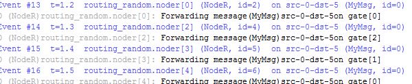
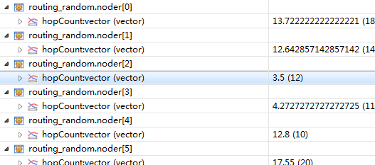
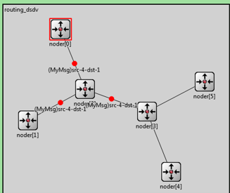
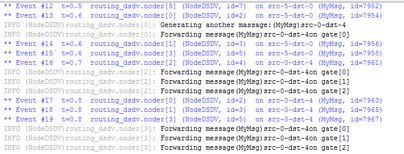
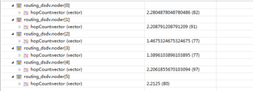
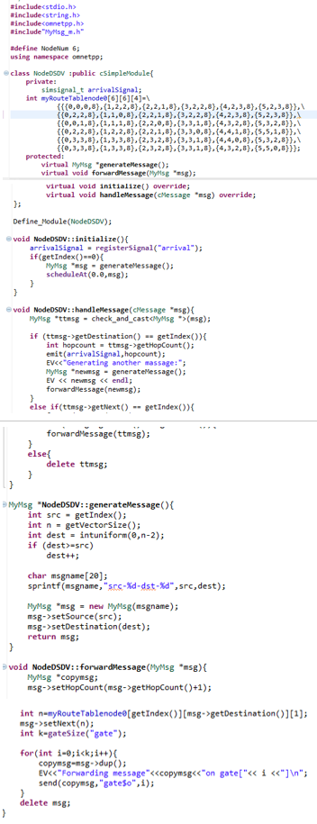

## 实验目的

* 了解多跳自组织网络基本原理及应用场景； 

* 掌握主动式或反应式拓扑探测技术； 

* 掌握表驱动或按需自适应路由技术；

## 实验内容

* 掌握 OMNet++ IDE 的使用，理解随机路由、DSDV 的原理并进行仿真
* 仿真协议性能指标

## 实验内容

随机路由仿真拓扑图：


随机路由仿真传输日志：



参数：



代码：

```cpp
#include <stdio.h>
#include <string.h>
#include <omnetpp.h>
#include "MyMsg_m.h"

using namespace omnetpp;

class NodeR : public cSimpleModule{
    private:
        simsignal_t arrivalSignal;
    protected:
        virtual MyMsg *generateMessage();
        virtual void forwardMessage(MyMsg *msg);
        virtual void initialize() override;
        virtual void handleMessage(cMessage *msg) override;
};

Define_Module(NodeR);
void NodeR :: initialize(){
    arrivalSignal = registerSignal("arrival");
    if(getIndex() == 0){
        MyMsg *msg = generateMessage();
        scheduleAt(0.0, msg);
    }
}
void NodeR :: handleMessage(cMessage *msg){
    MyMsg *ttmsg = check_and_cast<MyMsg*>(msg);
    if(ttmsg -> getDestination() == getIndex()){
        int hopcount = ttmsg -> getHopCount();
        emit(arrivalSignal, hopcount);
        EV << "Message" << ttmsg << "arrivad after" << hopcount << "hops.\n";
        bubble("ARRIVED, starting new one !");
        delete ttmsg;
        EV << "Generating another message:";
        MyMsg *newmsg = generateMessage();
        EV << newmsg << endl;
        forwardMessage(newmsg);
    }else{
        forwardMessage(ttmsg);
    }
}
MyMsg *NodeR :: generateMessage(){
    int src = getIndex();
    int n = getVectorSize();
    int dest = intuniform(0, n - 2);
    if(dest >= src){
        dest++;
    }
    char msgname[20];
    sprintf(msgname, "src-%d-dst-%d", src, dest);
    MyMsg *msg = new MyMsg(msgname);
    msg -> setSource(src);
    msg -> setDestination(dest);
    return msg;
}
void NodeR::forwardMessage(MyMsg *msg){
    msg -> setHopCount(msg -> getHopCount() + 1);
    int n = gateSize("gate");
    int k = intuniform(0, n - 1);
    EV << "Forwarding message" << msg << "on gate [" << k << "] \n";
    send(msg, "gate$o", k);
}

```

DSDV拓扑图：



DSDV输出日志：



DSDV参数：



节点0 ：

| 目的节点 | 下一跳节点 | 跳数 | 序号 |
| -------- | ---------- | ---- | ---- |
| 0        | 0          | 0    | 8    |
| 1        | 2          | 2    | 8    |
| 2        | 2          | 1    | 8    |
| 3        | 2          | 2    | 8    |
| 4        | 2          | 3    | 8    |
| 5        | 2          | 3    | 8    |

节点1：

| 目的节点 | 下一跳节点 | 跳数 | 序号 |
| -------- | ---------- | ---- | ---- |
| 0        | 2          | 2    | 8    |
| 1        | 1          | 0    | 8    |
| 2        | 2          | 1    | 8    |
| 3        | 2          | 2    | 8    |
| 4        | 2          | 3    | 8    |
| 5        | 2          | 3    | 8    |

节点2：

| 目的节点 | 下一跳节点 | 跳数 | 序号 |
| -------- | ---------- | ---- | ---- |
| 0        | 0          | 1    | 8    |
| 1        | 1          | 1    | 8    |
| 2        | 2          | 0    | 8    |
| 3        | 3          | 1    | 8    |
| 4        | 3          | 2    | 8    |
| 5        | 3          | 2    | 8    |

节点3：

| 目的节点 | 下一跳节点 | 跳数 | 序号 |
| -------- | ---------- | ---- | ---- |
| 0        | 2          | 2    | 8    |
| 1        | 2          | 2    | 8    |
| 2        | 2          | 1    | 8    |
| 3        | 3          | 0    | 8    |
| 4        | 4          | 1    | 8    |
| 5        | 5          | 1    | 8    |

节点4：

| 目的节点 | 下一跳节点 | 跳数 | 序号 |
| -------- | ---------- | ---- | ---- |
| 0        | 3          | 3    | 8    |
| 1        | 3          | 3    | 8    |
| 2        | 3          | 2    | 8    |
| 3        | 3          | 1    | 8    |
| 4        | 4          | 0    | 8    |
| 5        | 3          | 2    | 8    |

节点5：

| 目的节点 | 下一跳节点 | 跳数 | 序号 |
| -------- | ---------- | ---- | ---- |
| 0        | 3          | 3    | 8    |
| 1        | 3          | 3    | 8    |
| 2        | 3          | 2    | 8    |
| 3        | 3          | 1    | 8    |
| 4        | 3          | 2    | 8    |
| 5        | 5          | 0    | 8    |

代码：



结果：

随机路由仿真时数据包在节点之间随机发送，直到数据包达到目的节点

采用距离矢量路由协议的路由器，根据路由表转发报文，DSDV协议下数据包平均跳数小于随即路由

