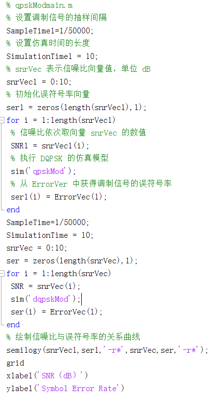
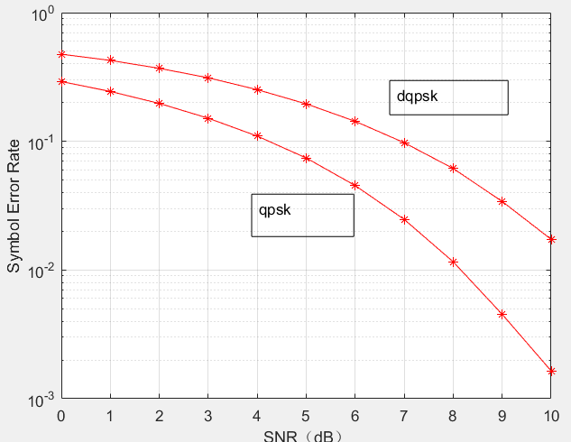
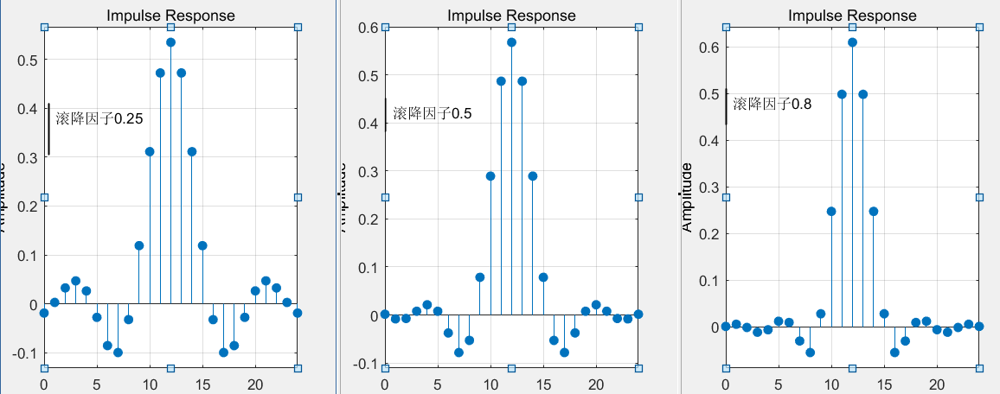

## 实验目的

* 掌握 DQPSK 调制解调原理及 Matlab Simulink 仿真方法
* 掌握升余弦成型滤波器原理及 Matlab Simulink 仿真方法

## 实验原理

DQPSK 又叫四相相对相移键控。 QPSK 具有固定的参考相位，它是以四进制码元本身的相位值来表示信息的，而 DQPSK 没有固定的参考相位，它是以前后两个码元的相位差值来表示信息的，由于 DQPSK 传输信息的特有方式，使得解调时不存在相位模糊问题，这是因为不论提取的载波取什么起始相位，对相邻两个四进制码元来说都是相等的，那么相邻两个四进制码元的相位差肯定与起始相位无关，也就不存在由于相干解调载波起始相位不同而引起的相位模糊问题，所以，在使用中都采用相对的四相调制。本实验通过matlab和simulink仿真，在相同噪声下qpsk与dqpsk的误比特率，得出其性能对比。

## 实验仿真结果

代码：

误码率曲线：

在单径高斯白噪声信道中，qpsk误码率更小，性能好于dqpsk

不同滚降因子升余弦成型滤波器的冲激响应曲线：

## 总结

分析dqpsk和qpsk的抗噪声性能，设计了不同滚降因子的升余弦滤波器

实验表明dqpsk具有良好的抗衰落特性，且接收机简单，实现难度更小

