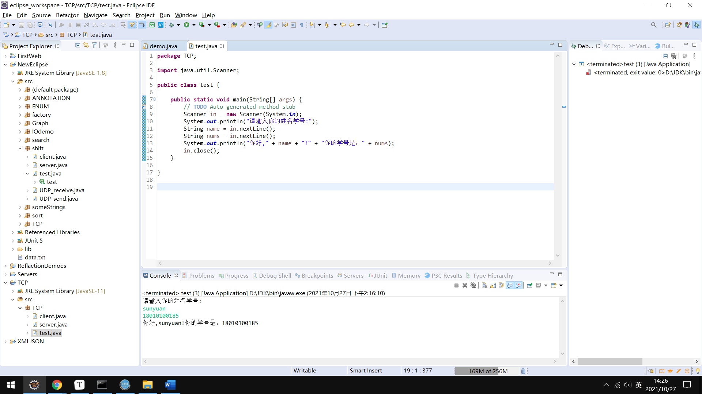
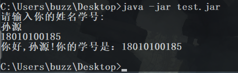

# 实验目的

本次实验主要任务是熟悉基于 JAVA 的软件应用开发流程，了解开发环境的搭建和运行过程，掌握 LINUX 平台下 JAR 的运行机制。为了实现上述任务，需要完成 LINUX 虚拟机的安装， JDK 的安装、 IDE 的安装、 基本的”Hello World”程序的开发和运行，在完成上述要求后，要独立完成将用户输入的文本回显的程序。从而掌握最基本的 JAVA 程序开发、部署、运行。

# 实验步骤

## win平台

• JDK的下载和安装

•设置相关的 JAVA_HOME 和 Path 环境变量（13版本不需要CLASSJAVA的设置）

•安装 eclipse

•建立工程文件

•export JAR文 件

•命令行执行JAR文件

## linux平台

•安装 Vmware Workstation

•安装Ubuntu

•linux 系统配置

•执行JAR文件

# 代码

```java
package TCP;

import java.util.Scanner;

public class test {

	public static void main(String[] args) {
		// TODO Auto-generated method stub
		Scanner in = new Scanner(System.in);
		System.out.println("请输入你的姓名学号:");
		String name = in.nextLine();
		String nums = in.nextLine();
		System.out.println("你好," + name + "!" + "你的学号是：" + nums);
		in.close();
	}

}
```



# 实验截图

## win平台



## linux平台

# 心得体会

