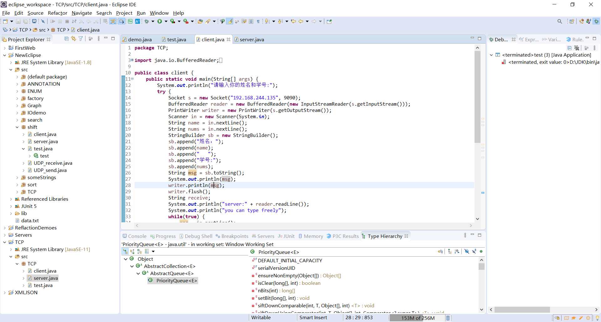
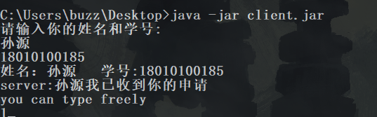
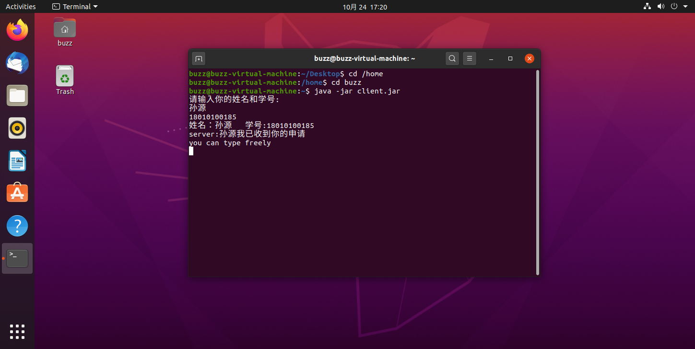
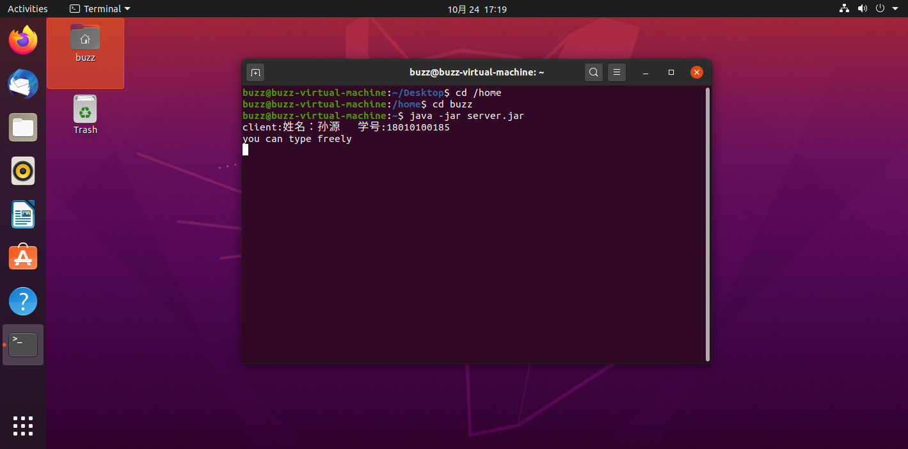

# 实验目的

* 掌握基本的 TCP/UDP 概念； 

* 会使用 DatagramSocket 和 DatagramPacket； 

* 会使用 Socket 和 ServerSocket； 

* 会利用 IDE 开发和调试编写的应用程序;

# 实验步骤

win平台下使用IDE开发server和client，使其完成TCP通信

# 代码

* client.java

```java
package TCP;

import java.io.BufferedReader;
import java.io.IOException;
import java.io.InputStreamReader;
import java.io.PrintWriter;
import java.net.Socket;
import java.util.Scanner;

public class client {
	public static void main(String[] args) {
		System.out.println("请输入你的姓名和学号:");
		try {
			Socket s = new Socket("192.168.244.135", 9090);
			BufferedReader reader = new BufferedReader(new InputStreamReader(s.getInputStream()));
			PrintWriter writer = new PrintWriter(s.getOutputStream());
			Scanner in = new Scanner(System.in);
			String name = in.nextLine();
			String nums = in.nextLine();
			StringBuilder sb = new StringBuilder();
			sb.append("姓名：");
			sb.append(name);
			sb.append("   ");
			sb.append("学号:");
			sb.append(nums);
			String msg = sb.toString();
			System.out.println(msg);
			writer.println(msg);
			writer.flush();
			String receive;
			System.out.println("server:" + reader.readLine());
			System.out.println("you can type freely");
			while(true) {
				msg = in.nextLine();
				System.out.println("client:" + msg);
				writer.println(msg);
				writer.flush();
				if(msg.equals("exit")) {
					break;
				}
				receive = reader.readLine();
				System.out.println("server:" + receive);
			}
			in.close();
			writer.close();
			reader.close();
			s.close();
		} catch (IOException e) {
			// TODO Auto-generated catch block
			e.printStackTrace();
		}
		
	}
}
```

* server.java

```java
package TCP;

import java.io.BufferedReader;
import java.io.IOException;
import java.io.InputStreamReader;
import java.io.PrintWriter;
import java.net.ServerSocket;
import java.net.Socket;
import java.util.Scanner;

public class server {

	public static void main(String[] args) throws IOException {
		ServerSocket  ss = new ServerSocket(9090);
		Socket s = ss.accept();
		BufferedReader reader = new BufferedReader(new InputStreamReader(s.getInputStream()));
		PrintWriter writer = new PrintWriter(s.getOutputStream());
		Scanner in = new Scanner(System.in);
		String msg;
		String receive;
		System.out.println("client:" + reader.readLine());
		msg = "孙源我已收到你的申请";
		writer.println(msg);
		writer.flush();
		System.out.println("you can type freely");
		while(true) {
			receive = reader.readLine();
			System.out.println("client:" + receive);
			if(receive.equals("exit")) {
				break;
			}
			msg = in.nextLine();
			writer.println(msg);
			writer.flush();
		}
		in.close();
		writer.close();
		reader.close();
		s.close();
		ss.close();
	}

}
```

# 截图

## IDE截图



## 运行结果截图

### win平台

* client



* server


### linux平台

* client



* server



# 心得体会

