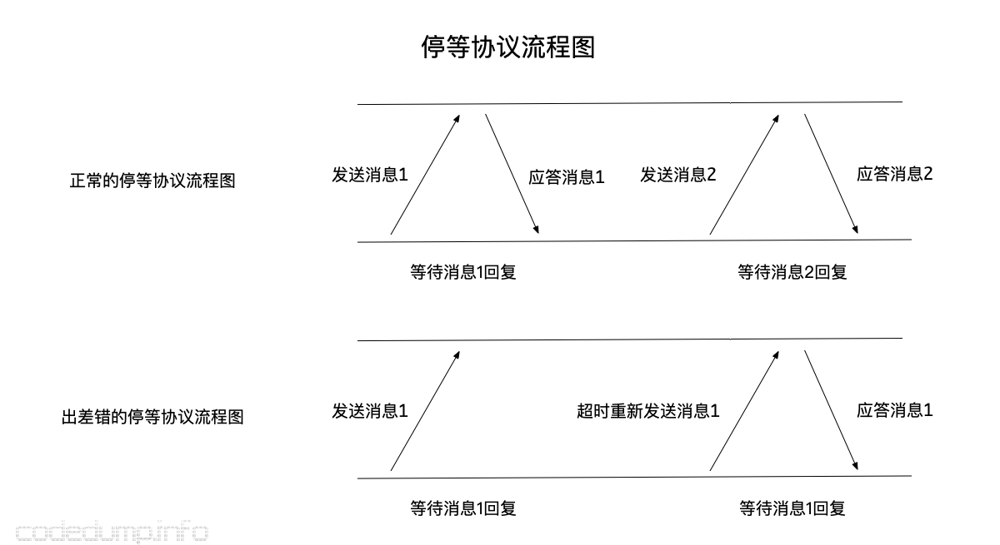
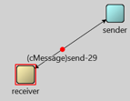
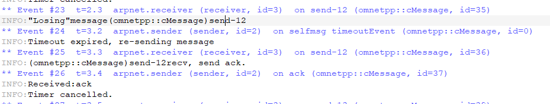
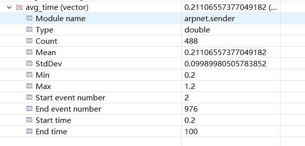
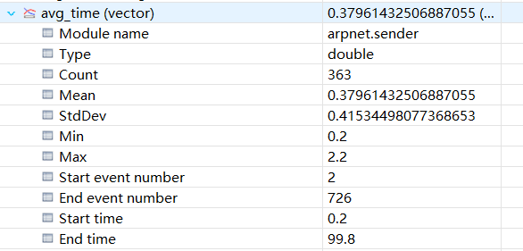
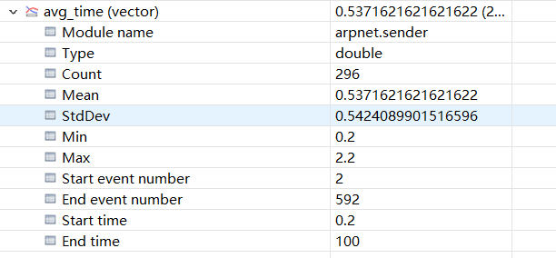
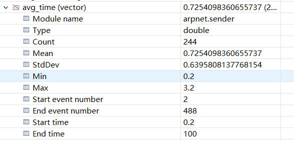
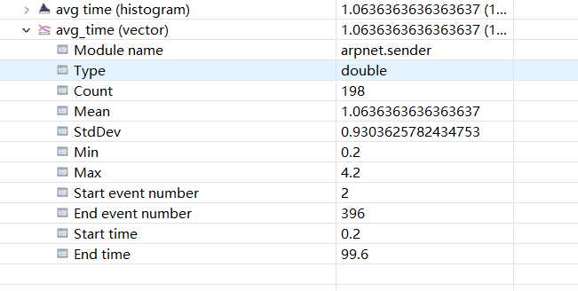
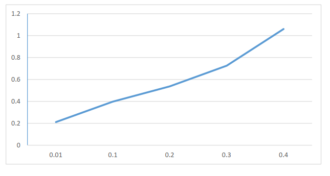

# 实验目的

实现报文自动收发和重传功能，实现ARQ协议

# 实验要求

* 掌握常规组帧协议及收发实现方法
* 掌握CRC基本原理及常用CRC计算公式和实现方法
* 掌握停等式ARQ的原理和实现方法

# 实验内容

* 实现停等式ARQ协议仿真
* 仿真协议性能指标数据帧平均响应时间
* 设计ARQ协议，添加CRC校验程序，并给出相关性能仿真

# 实验截图

## ARQ协议流程图



## ARQ实现代码

* 接收方：

```c++
/*
 * receiver.cpp
 *
 *  Created on: 2021年10月21日
 *      Author: 孙源 18010100185
 */
#include <string.h>
#include <omnetpp.h>
using namespace omnetpp;
class receiver : public cSimpleModule{
    protected:
        virtual void handleMessage(cMessage *msg);
};
Define_Module(receiver);
void receiver::handleMessage(cMessage * msg){
    if(uniform(0, 1) < 0.1){
        EV << "\"Losing\"message" << msg << endl;
        bubble("message lost");
        delete msg;
    }else{
        EV << msg << "recv, send ack.\n";
        delete msg;
        send(new cMessage("ack"), "out");
    }
}

```

* 发送方：

```cpp
/*
 * sender.cpp
 *
 *  Created on: 2021年10月21日
 *      Author: 孙源18010100185
 */

#include <string.h>
#include <omnetpp.h>
using namespace omnetpp;
class sender : public cSimpleModule{
    private :
        simtime_t txtime;
        simtime_t ack_time;
        simtime_t avg_time;
        cHistogram Avg_Time_Stats;
        cOutVector Avg_Time_Vector;
        int seq;
        cMessage *timeoutEvent;
        simtime_t timeout;
        cMessage *message;
    public :
        sender();
        virtual ~sender();
    protected :
        virtual void initialize();
        virtual void handleMessage(cMessage *msg);
        virtual void sendCopyOf(cMessage *msg);
        virtual cMessage *generateNewMessage();
        virtual void finish();
};
Define_Module(sender);
sender :: sender(){
    timeoutEvent = NULL;
    message = NULL;
}
sender :: ~sender(){
    cancelAndDelete(timeoutEvent);
    delete message;
}
cMessage *sender :: generateNewMessage(){
    txtime = simTime();
    char msgname[20];
    sprintf(msgname, "send-%d", ++seq);
    cMessage *msg = new cMessage(msgname);
    return msg;
}
void sender :: sendCopyOf(cMessage *msg){
    cMessage *copy = (cMessage *) msg -> dup();
    send(copy, "out");
}
void sender :: initialize(){
    txtime = 0;
    ack_time = 0;
    avg_time = 0;
    WATCH(txtime);
    WATCH(ack_time);
    Avg_Time_Stats.setName("avg_timsStats");
    Avg_Time_Vector.setName("avg_time");
    seq = 0;
    timeout = 1.0;
    timeoutEvent = new cMessage("timeoutEvent");
    EV << "sending initial message \n";
    message = generateNewMessage();
    sendCopyOf(message);
    scheduleAt(simTime() + timeout, timeoutEvent);
}
void sender :: handleMessage(cMessage *msg){
    ack_time = simTime();
    avg_time = ack_time - txtime;
    Avg_Time_Vector.record(avg_time);
    Avg_Time_Stats.collect(avg_time);
    if(msg == timeoutEvent){
        EV << "Timeout expired, re-sending message\n";
        sendCopyOf(message);
        scheduleAt(simTime() + timeout, timeoutEvent);
    }else{
        EV << "Received:" << msg -> getName() << "\n";
        delete msg;
        EV << "Timer cancelled.\n";
        cancelEvent(timeoutEvent);
        delete message;
        message = generateNewMessage();
        sendCopyOf(message);
        scheduleAt(simTime() + timeout, timeoutEvent);
    }
}
void sender :: finish(){
    EV << "avg, mean:" << Avg_Time_Stats.getMean() << endl;
    EV << "avg, min:" << Avg_Time_Stats.getMin() << endl;
    EV << "avg, max:" << Avg_Time_Stats.getMax() << endl;
    EV << "avg, stddev:" << Avg_Time_Stats.getStddev() << endl;
    recordScalar("#tx time", txtime);
    recordScalar("#ack time", ack_time);
    Avg_Time_Stats.recordAs("avg time");

}
```

## 仿真动画截图



## 传输正确信息和传输错误信息



## 不同误码率时的平均时间

* 误码率为0.01时：



* 误码率为0.1时：



* 误码率为0.2时：



* 误码率为0.3时：



* 误码率为0.4：



* 平均时间随误码率曲线



# 心得体会

