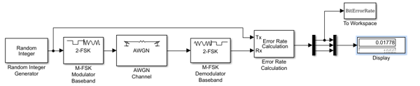
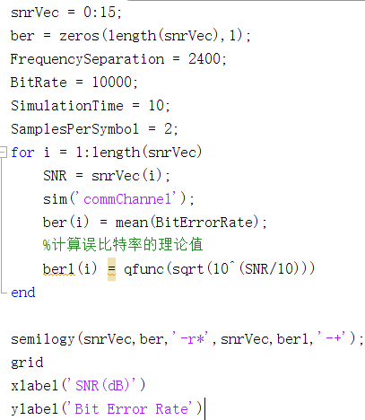
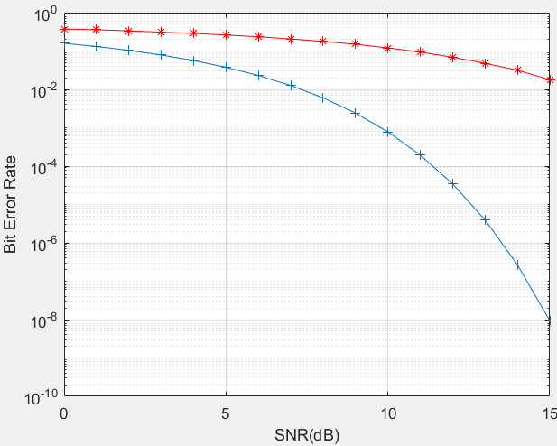
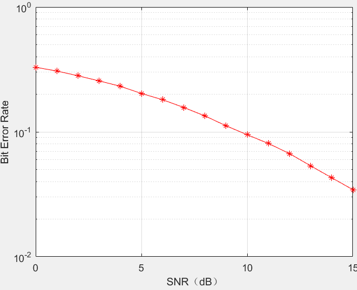

## 实验目的

* 掌握Matlab Simulink 搭建简单搭建简单数字基带传输系统的方法
* 掌握 Matlab Simulink 通信信道的仿真方法
* 理解蒙特卡罗仿真算法的思想

## 实验原理

蒙特卡罗估计是指通过随机实验估计系统参数值的过程。蒙特卡罗算法的基本思想是：用统计的方法来描述随机实验中的结果。如果实验次数为N，事件A发生的次数为NA，事件 A 的发生概率近似为相对频率 NA/N。事件A发生的概率可以通过重复无限多次随机实验求得，即：$P(A) = \lim_{n\to +\infty}\frac{N_A}{N}$在数字通信系统中，若N是发送端发送的码元总数，$N_A$是差错发生的次数，则总误码率为 $\frac{N_A}{N}$。

## 实验内容

搭建数字基带传输系统，设置信源、基带调制、基带解调、加性高斯白噪声等模块

代码：

运行曲线：

仿真结果明显高于理论计算结果，增大Samplespersymbol取值可以降低误码率使其接近理论结果

分析BFSK在多径瑞利衰弱信道中的传输性能：

高斯白噪声信道下的误比特率更小，传输条件好于多径瑞利衰落信道；

相比之下，高斯白噪声信道适合数据传输

