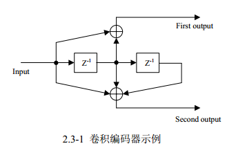
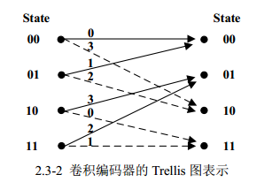
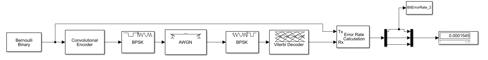
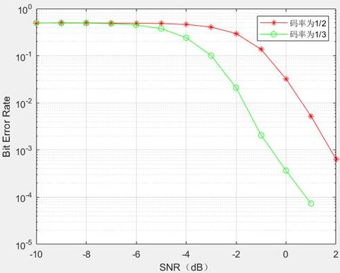
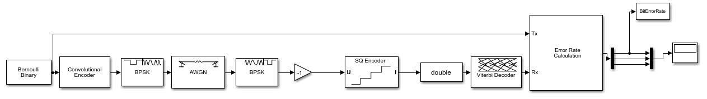
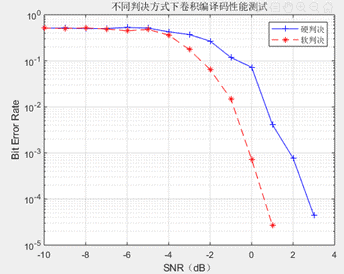
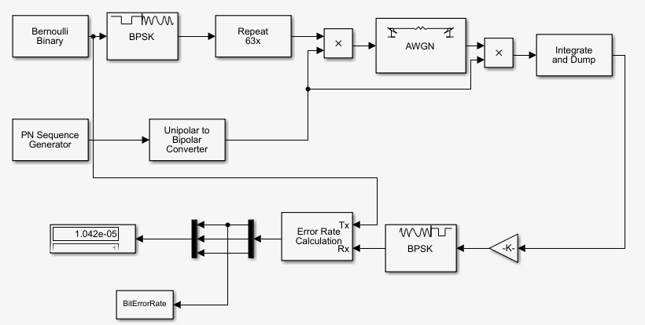
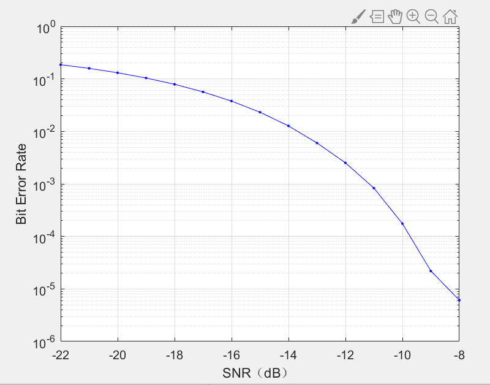

# 实验目的

* 掌握卷积码编译码的基本原理
* 掌握 Matlab Simulink 卷积码编译码仿真方法
* 掌握 Matlab Simulink 搭建简单数字基带直接序列扩频通信系统的方法

# 实验原理

卷积码在任何一段规定时间内产生的n个码元不仅取决于这段时间内输入的k个信息位，而且还取决于前N-1段时间内的信息位，这个N就称为卷积码的约束长度。在Matlab中，卷积码既可以用多项式来表示，也可以用Trellis图来表示，后者用途更广，下面举例来说明卷积码的编码器。卷积码编码器一般有一个或多个模二加法器（异或运算器），每个模二加法器都可以表示为一个多项式。下图 2.3-1 表示的是具有一个输入端和两个输出端，并且具有两个移位寄存器的卷积编码器。



卷积编码器的多项式表示由3部分组成：约束长度、生成多项式以及反馈连接多项式。卷积编码器的约束长度=移位寄存器个数+1，图 2.3-1卷积编码器约束长度等于3。卷积编码器的生成多项式按照如下方式确定：对于每一个模二加法器，按照从左到右的顺序依次检查每个移位寄存器（包括当前的输入信号），如果这个寄存器与模二加法器之间有连接，则标记为1，否则标记为0，由此可以得到一个二进制序列。把这个二进制序列表示成八进制数后，就得到与这个模二加法器相对应的生成多项式。图2.3-1中的卷积编码器，对应于第1个模二加法器的二进制序列是110， 对应于第2个模二加法器的二进制序列是111， 它们分别对应于八进制的6和7，则这个卷积编码器的生成多项式是[6 7]，这个编码器没有反馈，它的编码效率是1/2，即输入1位信息元，输出2位码元。

在Simulink中，卷积编码器和译码器的参数都是以Trellis图的方式表示。 下图2.3-2表示的是与图2.3-1所示的卷积编码器相对应的Trellis 图。在这个 Trellis图中，卷积编码器有4个状态（00,01,10,11），并且具有1位输入信号和 2位输出信号。Trellis图中的实线表示当前的输入信号是0，虚线表示输入信号是1，实线和虚线上的数字是输出信号的十进制表示。例如，假设卷积编码器当前状态是01，当它的输入信号是0 时，卷积编码器的输出信号是1（即二进制的01），同时转换到00状态；而当输入信号是1时，卷积编码器的输出信号是 2（即二进制的10）。同时转换到10 状态。



Matlab把多项式形式的卷积编码器转化成Trellis结构形式的函数：trellis = poly2trellis(ConstraintLength，CodeGenerator，FeedbackConnection)。图2.3-1所示的卷积编码器的多项式转换成Trellis结构的函数是：trellis = poly2trellis(3， [6 7])由Shannon定理可知，在信道容量一定的情况下增加传输带宽可以减小对信噪比的要求。直接序列扩频通信系统在发送端调制信号乘扩频序列（PN码序列）进行扩频，降低频谱密度。在接收端解扩时扩频信号乘扩频序列恢复出调制信号，噪声乘扩频序列相当于做了一次扩频， 频谱密度降低。所以在解调器的输入端信噪比增加。

# 实验内容

对约束长度都等于9，码率（编码效率）分别等于1/2和1/3的卷积码进行硬判决译码仿真，结果绘制在一张图中进行性能比较，实验报告中要有截图和脚本程序。其中码率为1/2的卷积编码器2个生成多项式用八进制数表示为753和 561，码率为 1/3 的卷积编码器3个生成多项式用八进制数表示为557、663和711。

* simulink系统图：



* .m文件

```matlab
% snrVec 表示信噪比向量值
snrVec = -10:5;
% 初始化
ber = zeros(length(snrVec),1);
for i = 1:length(snrVec)
 SNR = snrVec(i);
 sim('Two');
 % 计算 BitErrorRate 的均值
 berTwo(i) = mean(BitErrorRate); 
end
for i = 1:length(snrVec)
 SNR = snrVec(i);
 sim('Three'); 
 berThree(i) = mean(BitErrorRate); 
% 绘制信噪比和误比特率的关系曲线图，纵坐标采用对数坐标
semilogy(snrVec,berTwo,'-r*');
hold on
semilogy(snrVec,berThree,'-go');
legend('码率为1/2','码率为1/3');
grid
xlabel('SNR（dB）')
ylabel('Bit Error Rate')
```

* 结果



对同一个卷积码分别进行软判决译码和硬判决译码仿真，将仿真结果绘制在一张图中进行性能比较，实验报告中要有截图和脚本程序。（注意：软判决译码时解调器的参数设置与硬判决译码时不同）

* simulink系统图：



* .m文件

```matlab
% snrVec 表示信噪比向量值
snrVec = -10:5;
% 初始化
ber_hard = zeros(length(snrVec),1);
ber_soft = zeros(length(snrVec),1);
for i = 1:length(snrVec)
SNR = snrVec(i);
% 误比特率保存在工作区变量 BitErrorRate 中
sim('chanEndecode');
% 计算 BitErrorRate 的均值
ber_hard(i) = mean(BitErrorRate_hard);
sim('chanEndecode_2');
ber_soft(i) = mean(BitErrorRate_soft);
end
figure
semilogy(snrVec,ber_hard,'-b*',snrVec,ber_soft,'-b.');%semilogy(snrVec,ber_2,'-r*',snrVec,ber_3,'-b*');
legend('硬判决','软判决');
grid
xlabel('SNR（dB） ')
ylabel('Bit Error Rate')
```

* 结果：



* 分析：在相同信噪比的条件下，软判决的误比特率低于硬判决

绘制直接序列扩频通信系统信噪比SNR与误比特率的对应关系对数曲线图。实验报告中要有截图和脚本程序

* simulink系统图：



* .m文件

```matlab
% snrVec 表示信噪比向量值
snrVec = -22:-8;
% 初始化
ber = zeros(length(snrVec),1);
for i = 1:length(snrVec)
SNR = snrVec(i);
% 误比特率保存在工作区变量 BitErrorRate 中
sim('request_3');
% 计算 BitErrorRate 的均值
ber(i) = mean(BitErrorRate);
end
figure
semilogy(snrVec,ber,'-b.');%semilogy(snrVec,ber_2,'-r*',snrVec,ber_3,'-b*');
grid
xlabel('SNR（dB） ')
ylabel('Bit Error Rate')
```

* 结果



# 心得体会

