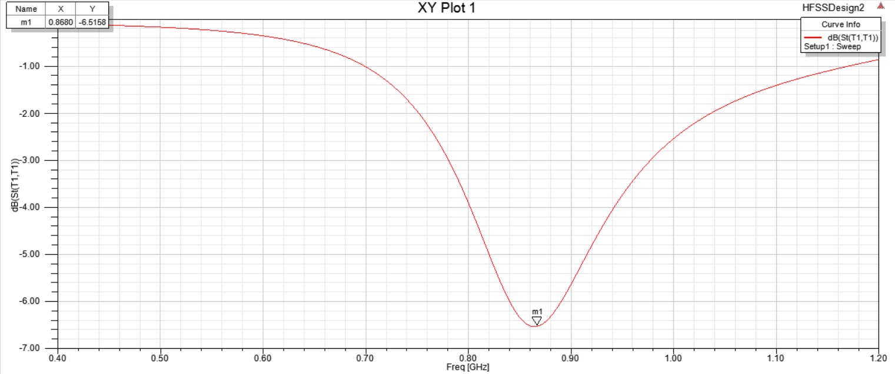

# 实验目的

* 掌握微带天线的设计方法
* 掌握微带天线的仿真方法  
*  给出设计天线的回波损耗等指标  

# 实验原理

本实验以“TI_DN024.pdf”为参考， 设计并仿真一款 PCB 天线，可以工作在
868MHz， 915 MHz 和 955 MHz 三种频率，属于 ISM（Industrial Scientific Medical）
频段。 这个天线可与德州仪器的所有收发器一起使用，这些收发器在这些频段工
作。 当使用最小可能的接地层时最大增益测量为-3.2 分贝。天线的总尺寸要求为
38 x 24 mm。 这是一个中等大小低成本的天线解决方案。图 2.1 显示了用于开发
和描述该天线特征的电路板。 电路板引脚与 CC1110 EM 兼容，可插入 SmartRF
04EB 进行测试和表征。  

# 实验内容和步骤

要获得最佳性能，必须精确设计天线尺寸。该天线是在 0.8mm 厚的 FR4 基
片上实现的。由于天线下面没有接地层，因此 PCB 厚度并不重要，但如果考虑
厚度变化的话，则需要调整天线的长度以获得最佳性能。
在 PCB CAD 工具中实现天线的一种方法是从 Gerber 文件导入天线布局。这
种文件包含在 CC1110EM 曲流天线参考设计中，称为“天线.spl”。如果天线安装
在更宽的 PCB 上，则必须避免在天线的每一侧放置元件或使接地层靠近天线的
每一侧。  

仿真模型：

## 曲线截图

* 回波损耗曲线

可见在频率为868MHz的时候回波损耗为-6.51dB

* 辐射图：

  * xy方向：

    

  * yz方向：

    

  * xz方向：

    

    

