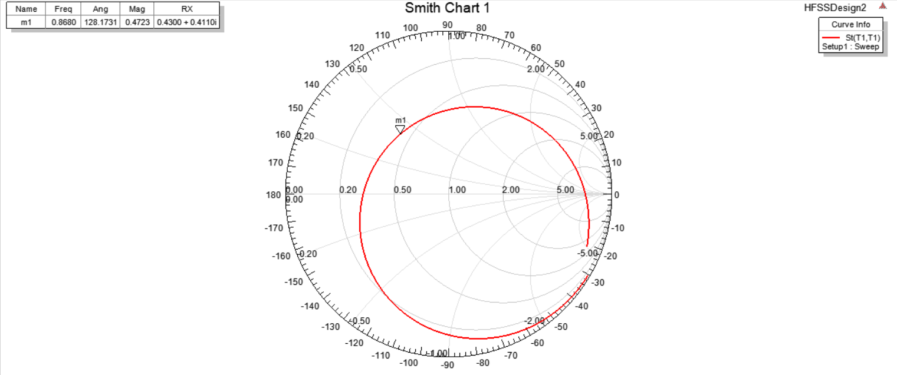

# 实验目的

* 理解smith圆图的概念
* 进行匹配电路的设计
* 进行匹配电路的仿真

# 实验原理

实验 1.1 以“TI_DN024.pdf”为参考， 设计并仿真一款 PCB 天线，可以工作
在 868MHz， 915 MHz 和 955 MHz 三种频率，属于 ISM（Industrial Scientific
Medical）频段。 这个天线可与德州仪器的所有收发器一起使用，这些收发器在这
些频段工作。  

在调试天线时，阻抗匹配对天线的性能影响很大，阻抗匹配的好坏可以直接
影响天线所发射信号的强弱。在进行天线的阻抗匹配调试时，借助于矢量网络分
析仪和史密斯圆图工具（Smith Chart）能够简单、方便、快速的完成阻抗匹配调
试工作。  

# 实验内容和步骤

使用史密斯圆图工具，设计实验 1.1 给出的天线的匹配电路，以提高天线的
性能。  

* 未匹配时史密斯圆图：

  

  此时归一化阻抗`Rx = 0.4300 + 0.4110i`，实际阻抗为`21.5+20.55i `

* 使用smith进行匹配：

  

  * 串联电容大小：

    

  * 并联电感大小：

    

* 匹配后回波损耗曲线：

  

  由图像易得此时回波损耗为-16.298dB

* 匹配后史密斯圆图：

  

  由图易得此时归一化阻抗值为`Rx = 0.9009 - 0.277i`

