# 实验目的

1. 掌握数字通信 $DQPSK$ 的调制解调方式
2. 学会运用 Matlab 编写 $DQPSK$ 调制解调程序
3. 掌握数字中频调制原理
4. 调制信号通过数字中频调制到射频信道（频率 300MHz），观察 $DQPSK$ 调制 的原始信号星座图，并绘制出调制后的频谱图。

#  实验原理

​	    DQPSK 把要传的基带信号先进行差分编码再进行四相相移键控；它在单 位频带内的信息传输速率可比 2DPSK 的提高一倍，抗噪声性能要比 2DPSK 的差 些，因而广泛用于高速数字传输系统。DQPSK 没有固定的参考相位，后一个四进 制码元总是以它相邻的前一个四进制码元的终止相位为参考相位（或称为基准相 位），因此，它是以前后两个码元的相位差值来表示信息的。由于 DQPSK 传输信 息的特有方式，使得解调时不存在相位模糊问题，这是因为不论提取的载波取什 么起始相位，对相临两个四进制码元来说都是相等的，那么相邻两个四进制码元 的相位差肯定与起始相位无关，也就不存在由于相干解调载波起始相位不同而引 起的相位模糊问题。

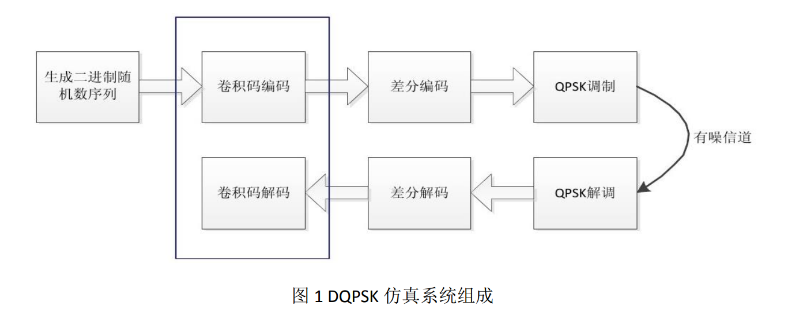

对每对连续的双比特其信号点至少 有$\pi / 4$ 的相位变化，从而使接收机容易进行时钟恢复和同步。

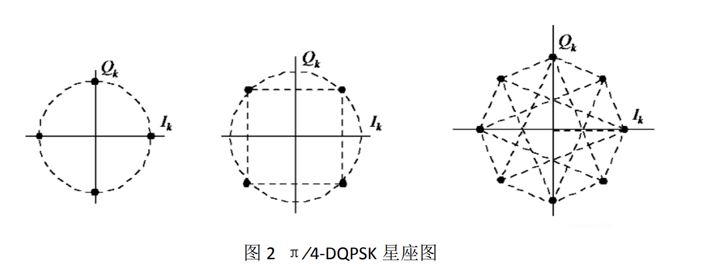

输入的二进制数据序列经过串/并变 换和差分相位编码输出同相支路信号 $I_k$ 和正交支路信号 $Q_k$，$I_k$ 和 $Q_k$ 的符号速率 是输入数据速率的一半。为抑制已调信号的带外功率辐射，在进行正交调制前先 使同相支路信号和正交支路信号 $I_k$ 和 $Q_k$ 通过具有线性相位特性和平方根升余弦 幅频特性的低通滤波器。

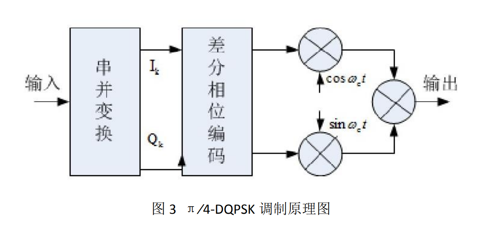

为了便于实现，经 常采用差分检测来解调$π⁄4DQPSK$ 信号。

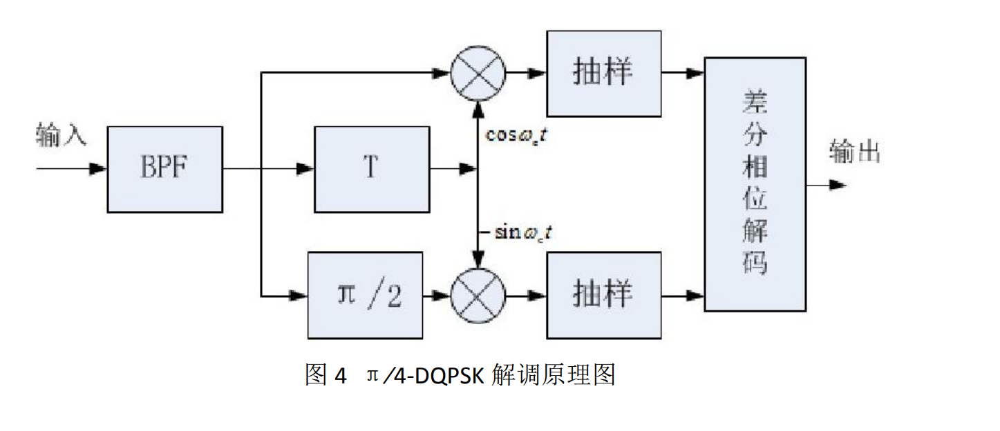

# 实验内容

* 设置仿真参数
* DQPSK 调制过程采用差分编码，并获取星座图
* 根升余弦 FIR 滤波器，中频频率 21.4MHz
* 获取中频频谱图
* 数字中频调制、调制到射频频率 300MHz
* 信道加频偏
* 接收信号
* 信号经过信道后，获得频偏下的眼图
* 纠频偏，获得纠正后的眼图
* 解差分，纠频偏前后眼图比较
* 设置加频偏的函数

```matlab
clc
clear all
close all
%% 参数 parameter
loop_n=2000; 
IPOINT=8;% 过采样倍数
fsb=10.7e6;%符号率
fs= IPOINT*fsb;%采样频率
f_shift = 21.4e6;
m = 4;
%% QPSK
backoff = 4;
alpha = 0.2;
s_ratio = 0.45;
EbN0 = [20];

for k = [1: length(EbN0)]
    source_bit = randi([0,1], 1, loop_n);
    %差分编码
    DPSKMod = comm.DPSKModulator(m,pi/4,'BitInput',true);
    sourceSymbols_RIGHT = step(DPSKMod,source_bit.');
    
    scatterplot(sourceSymbols_RIGHT)
    title('发送端星座图')
    %% 根升余弦fir滤波器，中频频率21.4MHz
    type_flag  = 'fir/sqrt';
    r = 0.25;
    delay = 4;
    tx_dat_RIGHT = rcosflt(sourceSymbols_RIGHT,fsb,fs,type_flag,r,delay);
    n_transient = IPOINT * 4 * 2;
    
    n  = length(tx_dat_RIGHT);
    F_shift_21_4  = exp(j*f_shift/fs*2*pi*[1:n]);
    tx_data = tx_dat_RIGHT.' .*(F_shift_21_4);
    
    %% 获取中频频谱图
    Nwin = 50;
    N = length(tx_data)/Nwin;
    Rectwindow = window(@rectwin,N);
    [PSD,FreqAxis] = pwelch(tx_data, Rectwindow,0,[],fs,'centered');
    figure,plot(FreqAxis/1e6, 10*log10(PSD));
    xlabel('f(MHZ)');
    ylabel('power spectrum (dB/Hz)')
    title('中频频谱图')
    %% 数字中频调制、调制到300MHz
    %300M射频
    f_carr  =300e6;
    fs_carr = 4*f_carr;
    tx_data_up = resample(tx_data,fs_carr,fs);
    n = length(tx_data_up);
    F_shift_300 = exp(j*f_carr/fs_carr*2*pi*[1:n]);
    tx_data_rf = tx_data_up .* (F_shift_300);
    
    %welch power spectrum
    Nwin = 50;
    N = length(tx_data_rf)/Nwin;
    Rectwindow = window(@rectwin, N);
    [PSD,FreqAxis] = pwelch(tx_data_rf, Rectwindow,0,[],fs_carr,'centered');
    figure,plot(FreqAxis/1e6, 10*log10(PSD));
    xlabel('f(MHZ)');
    ylabel('power spectrum (dB/Hz)')
    title('射频频谱图')
    
    %信道加频偏
    tx_data_up = tx_data_rf .* conj(F_shift_300);
    tx_data = resample(tx_data_up,fs,fs_carr);
    %信道
    SNR = EbN0(k) - 10*log(IPOINT) + 10*log10(log2(m));
    s_channel = awgn(tx_data,SNR,'measured');
    f_bias = 200e3;
    s_channel = chan_fc_bias(s_channel, f_bias,fs);
    %% 信号接收过程
    rx_data = s_channel(1:length(F_shift_21_4)) .* conj(F_shift_21_4);
    type_flag  ='fir/sqrt/Fs';
    rx_data = rcosflt(rx_data,fsb,fs,type_flag,r,delay);
    
    
    rx_re_align = rx_data(n_transient + 1:end);
    rx_downSample = rx_re_align(1:IPOINT:end-n_transient);
    %频偏眼图
    scatterplot(rx_downSample)
    title('频偏下星座图')
    eyediagram(rx_re_align(1:1000), IPOINT*4)
    title('频偏下眼图')
    
    %纠正频偏后的眼图
    rx_downSample  =chan_fc_bias(rx_downSample.',-1*f_bias,fsb);
    scatterplot(rx_downSample)
    title('校正频偏下的星座图')
    
    %解差分，纠频偏前后眼图比较
    rx_downSamplex = rx_downSample(2:end).*conj(rx_downSample(1:end-1));
    scatterplot(rx_downSamplex)
    title('解差分后的星座图')
    eyediagram(resample(rx_downSamplex(1:500),8,1),16)
    title('校正频偏解差分后的眼图')
    
    h = modem.pskdemod('M',m,'PhaseOffset',pi/4, 'SymbolOrder','Gray','OutputType','Bit');
    data_demod_bit = demodulate(h,rx_downSamplex);
    
    data_demod_bit  = reshape(data_demod_bit,1,[]);
    ref_bit = reshape(source_bit,1,[]);
    rx_N = length(data_demod_bit);
    BER_QPSK_simulation = sum(abs(data_demod_bit - ref_bit(3:end)))/rx_N;
end    
function out = chan_fc_bias(indata,fb,fc)
data_len = length(indata);
time_tic = [1:data_len]/fc;
bias_multi = exp(i*2*pi*fb*time_tic);
out = indata.*bias_multi;
end
```

# 实验结果

* 中频频谱图

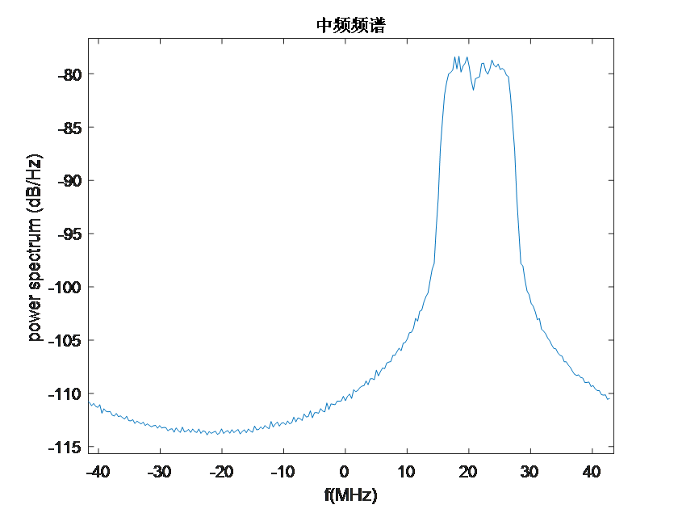

* 射频频谱图

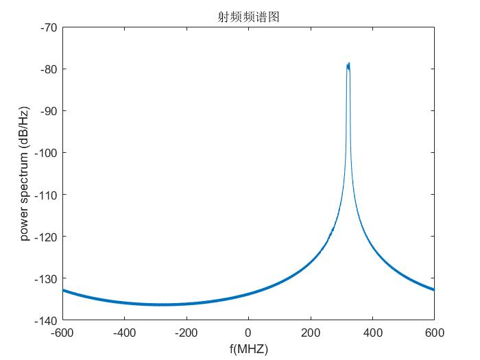

* 频偏下的星座图

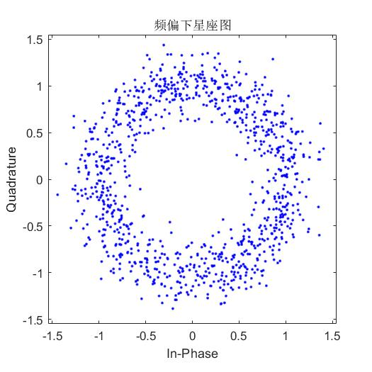

* 频偏下的眼图

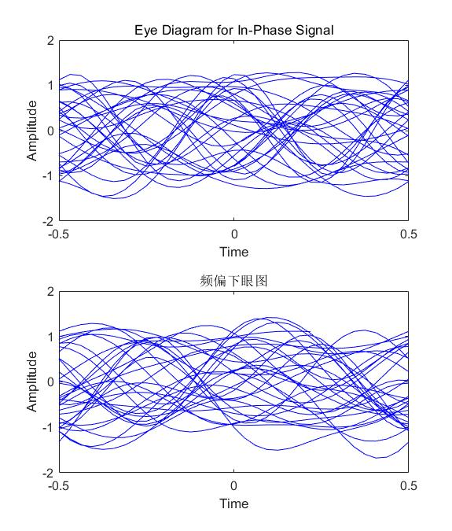

* 校正频偏下的星座图

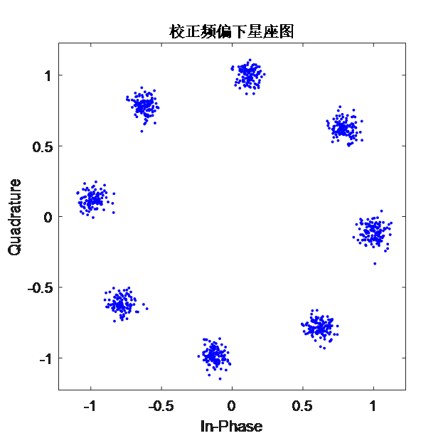

* 解差分后的星座图

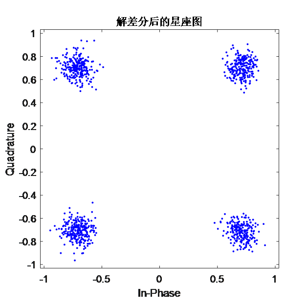

* 校正频偏解差分后的眼图

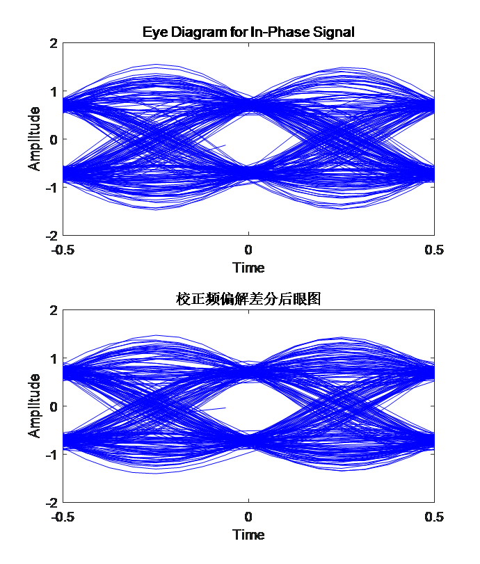

# 实验总结

